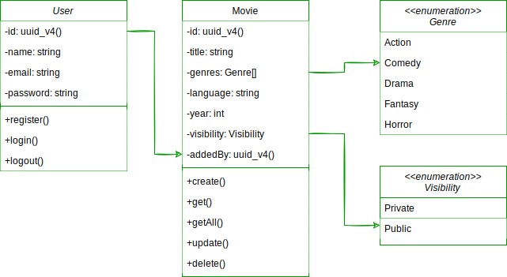

# movies-api

HTTP server api for performing CRUD operations on movies.

## Model

## How to start the api

1. Install dependencies `yarn`
2. Run docker db container `docker-compose up -d`
3. Run migration `yarn migrate`
4. `yarn dev`
